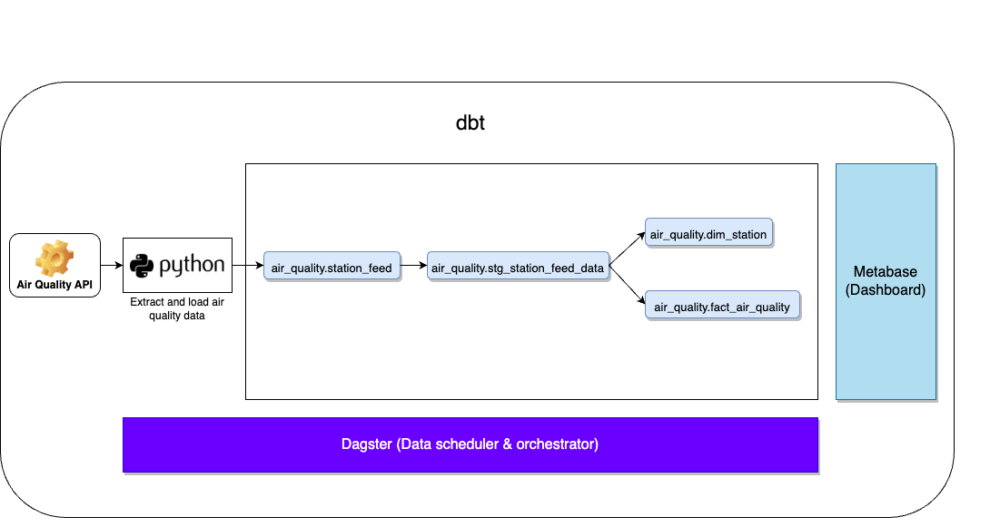
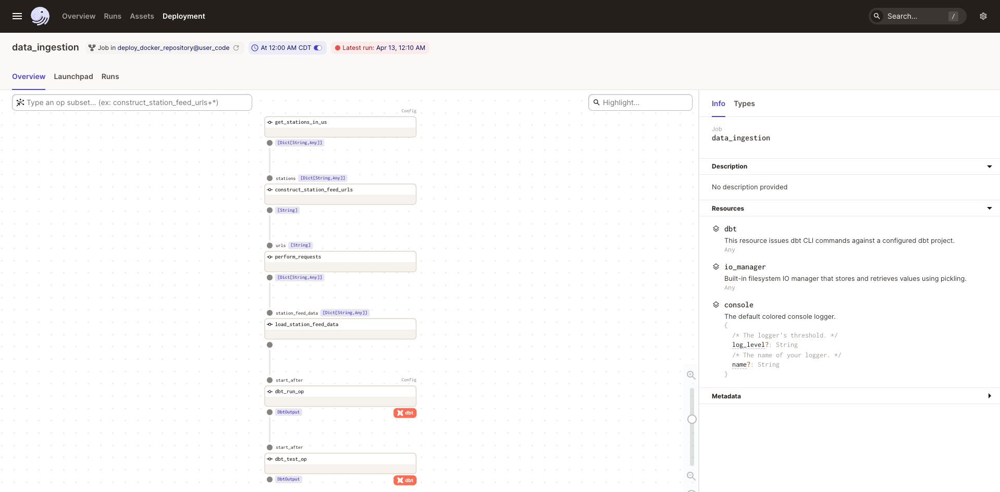
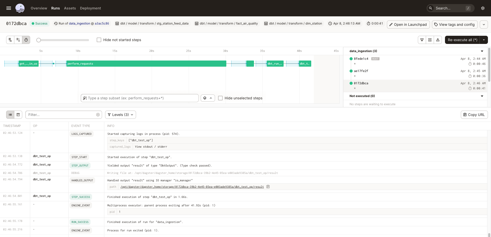
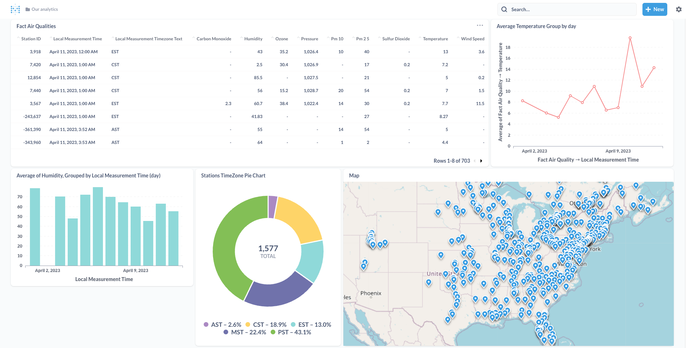

# Data engineering project: air quality data extraction to analysis

1. Fetch real-time air quality data using aqicn.org API and load the data into a PostgreSQL warehouse
2. Use dbt to transform data and create dimension and fact tables
3. Metabase hosted on AWS EC2 is used to do analysis on air quality in the US and create a dashboard
4. Pipeline is run by Dagster deployed to AWS EC2

# Architecture diagram


# Dagster data pipeline





# Metabase dashboard



# Directory Tree

```
air_quality/
┣ .github/
┃ ┗ workflows/
┃   ┗ ci.yml
┣ app/
┃ ┣ jobs/
┃ ┃ ┗ data_ingestion.py
┃ ┣ ops/
┃ ┃ ┗ extract_load.py
┃ ┣ schedules/
┃ ┃ ┗ data_ingestion_schedule.py
┃ ┣ transform/
┃ ┃ ┣ models/
┃ ┃ ┃ ┣ marts/
┃ ┃ ┃ ┃ ┣ core.yml
┃ ┃ ┃ ┃ ┣ dim_station.sql
┃ ┃ ┃ ┃ ┗ fact_air_quality.sql
┃ ┃ ┃ ┗ staging/
┃ ┃ ┃   ┣ src.yml
┃ ┃ ┃   ┣ stg.yml
┃ ┃ ┃   ┗ stg_station_feed_data.sql
┃ ┃ ┣ dbt_project.yml
┃ ┃ ┗ profiles.yml
┃ ┣ utils/
┃ ┃ ┣ config.py
┃ ┃ ┣ db.py
┃ ┃ ┗ helpers.py
┃ ┣ .env
┃ ┗ repository.py
┣ assets/
┃ ┗ images/
┃   ┣ arch_diagram.png
┃   ┣ dagster_pipeline.png
┃   ┣ dagster_run.png
┃   ┗ dashboard.png
┣ container/
┃ ┣ dagster/
┃ ┃ ┗ Dockerfile
┃ ┣ formatter/
┃ ┃ ┣ Dockerfile
┃ ┃ ┗ requirements.txt
┃ ┗ user_code/
┃   ┗ Dockerfile
┣ terraform/
┃ ┣ main.tf
┃ ┣ output.tf
┃ ┗ variable.tf
┣ test/
┃ ┗ unit/
┃   ┣ test_extract_load_unit.py
┃   ┗ test_utils_unit.py
┣ warehouse_db_setup/
┃ ┗ create_tables.sql
┣ .env
┣ .gitignore
┣ Makefile
┣ README.md
┣ dagster.yaml
┣ docker-compose.yml
┗ workspace.yaml
```

## Setup

### Pre-requisites

1. [git](https://git-scm.com/book/en/v2/Getting-Started-Installing-Git)
2. [Github account](https://github.com/)
3. [Terraform](https://developer.hashicorp.com/terraform/tutorials/aws-get-started/install-cli)
4. [AWS account](https://aws.amazon.com/)
5. [AWS CLI Installed](https://docs.aws.amazon.com/cli/latest/userguide/getting-started-install.html) and [configured](https://docs.aws.amazon.com/cli/latest/userguide/cli-chap-configure.html)
3. [Air Quality Open Data Platform API Token](https://aqicn.org/data-platform/token/)
4. [Docker](https://docs.docker.com/engine/install/) with at least 4GB of RAM and [Docker Compose](https://docs.docker.com/compose/install/) v1.27.0 or later

Run these commands to set up the project locally.

```shell
# Clone the code as shown below
git clone https://github.com/sivaho2015/air_quality.git
cd air_quality

# Paste your AWS Access Key ID and AWS Secret Access Key in .env file


# Local run & test
make up # start the docker containers on your computer

# Create AWS services with Terraform
make tf-init # Only needed on your first terraform run (or if you add new providers)
make infra-up # type in yes after verifying the changes TF will make

# Wait until the EC2 instance is initialized, you can check this via your AWS UI
# See "Status Check" on the EC2 console, it should be "2/2 checks passed" before proceeding
# SSH into the EC2 instance and paste your Air Quality API token in air_quality/app/.env file and run 'make up'

make cloud-metabase # this command will forward Metabase port from EC2 to your machine and opens it in the browser

make cloud-dagster # this command will forward Dagster port from EC2 to your machine and opens it in the browser
```

### Tear down infra

Run this command to tear down infrastructure

```shell
make down # stop docker containers on your computer
```

## References

1. [Dagster docs](https://docs.dagster.io/tutorial)
2. [Metabase docs](https://www.metabase.com/learn/getting-started/getting-started.html)
3. [Dagster docker setup](https://github.com/dagster-io/dagster/tree/0.14.17/examples/deploy_docker)
4. [dbt docs](https://docs.getdbt.com/)
5. [aqicn.org API docs](https://aqicn.org/json-api/doc/)